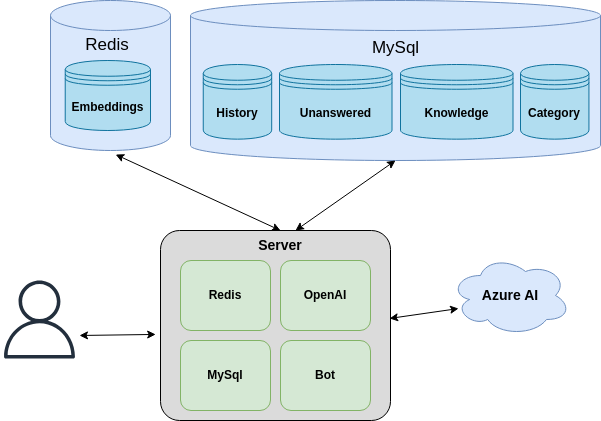
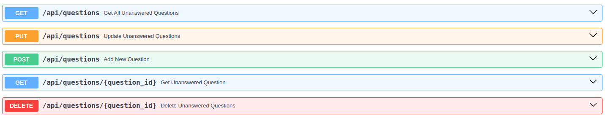

# chAItBot

# Fast Backend
ChatGPT-Bot Backend module 

# High Level Diagram


# Getting Started
## Environment Variables
The following environment variables are needed to run the code_generator tool:

### Redis related environment variables
| **Environment Variable**      | **Description**                                         |
|-------------------------------|---------------------------------------------------------|
| REDIS_HOST                    | Redis host instance to be used                          |
| REDIS_PORT                    | Redis port instance to be used                          |
| REDIS_EMBEDDINGS_DB           | Redis DB index used to get/post data from/to the bot    |
| REDIS_HISTORY_DB              | Redis DB index used as a bot's cache history            |
| REDIS_UNANSWERED_QUESTIONS_DB | Redis DB index used as storage for unanswered questions |
| REDIS_PASSWORD                | Redis password used to connect to Redis instance        |
| REDIS_SSL                     | True if SSL is going to be used. False, otherwise       |

### MySQL related environment variables
| **Environment Variable** | **Description**                                |
|--------------------------|------------------------------------------------|
| MYSQL_HOST               | MySQL host instance to be used                 |
| MYSQL_PORT               | MySQL port instance to be used                 |
| MYSQL_USER               | MySQL DB user to connect with the database     |
| MYSQL_PASSWORD           | MySQL DB password to connect with the database |
| MYSQL_DB_NAME            | MySQL DB name to connect with the database     |

### OpenAI related environment variables
| **Environment Variable**                  | **Description**                                                                                                                                       |
|-------------------------------------------|-------------------------------------------------------------------------------------------------------------------------------------------------------|
| OPENAI_API_KEY                            | The OpenAI Api Key to be used                                                                                                                         |
| OPENAI_CHAT_MODEL                         | The specific OpenAI Model for chatting to be used (i.e. telecentro-gpt-35-turbo)                                                                      |
| OPENAI_EMBEDDING_MODEL                    | The specific OpenAI Model for embeddings to be used (i.e. telecentro-text-embedding-ada-002)                                                          |
| OPENAI_TYPE                               | The type of OpenAI to be used ("azure" or None for openai)                                                                                            |
| OPENAI_RETRIES                            | Number of retries in case of error                                                                                                                    |
| OPENAI_RETRY_SLEEP_TIME                   | Time to wait (in seconds) until the next retry                                                                                                        |
| OPENAI_STATS                              | Boolean to enable stats computation                                                                                                                   |
| OPENAI_COMPLETION_INPUT_PRICE             | OpenAI completion model input price                                                                                                                   |
| OPENAI_COMPLETION_OUTPUT_PRICE            | OpenAI completion model output price                                                                                                                  |
| OPENAI_EMBEDDINGS_PRICE                   | OpenAI embeddings model price                                                                                                                         |
| OPENAI_TEMPERATURE                        | The sampling temperature, between 0 and 1                                                                                                             |
| OPENAI_TOP_PRIORITY                       | An alternative to sampling with temperature, called nucleus sampling, where the model considers the results of the tokens with top_p probability mass |

## Preparing the environment
The following steps are needed to properly use the tool:
1. Create a venv: `python3.11 -m venv venv`
2. Activate the venv: `source venv/bin/activate`
3. Install all needed dependencies:
  `(venv) pip install -r requirements/dev.txt -r requirements/prod.txt`

Once the above steps are done, the environment will be ready to execute the tool successfully.


# Installing Redis

To start a Redis Stack container using the redis-stack image, run the following command in your terminal:

```
docker run -d --name redis-stack -p 6379:6379 -p 8001:8001 redis/redis-stack:latest
```


The docker run command above also exposes RedisInsight on port 8001. You can use RedisInsight by pointing your browser to localhost:8001.


# Available APIS 

## Unanswered Questions
| **Method** | **URL Pattern**              | **Description**                                                   |
|------------|------------------------------|-------------------------------------------------------------------|
| GET        | /api/questions               | Method to return the current list of unanswered questions         |
| PUT        | /api/questions               | Method to update a specific unanswered questions                  |  
| POST       | /api/questions               | Method to add a new unanswered question into the database         |
| GET        | /api/questions/{question_id} | Method to a specific unanswered question based on its id          |
| DELETE     | /api/questions/{question_id} | Method to delete a specific unanswered question from the database |



For further information visit http://127.0.0.1:8000/docs when the server is up.

# Installing the Server
<TBC></TBC>

## How To Use
The following is needed to be executed to get the server instance up and running:
```shell
python -m server
```

An alternative way to run the server is to use `uvicorn` as follows:
```shell
uvicorn server.__main__:app --reload
```


# Developer Guide

The following is documentation for developers that would like to contribute to this project:

## Local Linting

There are a few linters/code checks included with this project to speed up the
development process:

* Black - An automatic code formatter, never think about python style again.
* Isort - Automatically organizes imports in your modules.
* Pylint - Check your code against many of the python style guide rules.
* Mypy - Check your code to make sure it is properly typed.

You can run these tools automatically in check mode, meaning you will get an error
if any of them would not pass with:

```
./tools/run_checks.bat
```

Or actually automatically apply the fixes with:

```
./tools/apply_linters.bat
```

There are also scripts in `./tools/` that includes run/check for each individual
tool.
