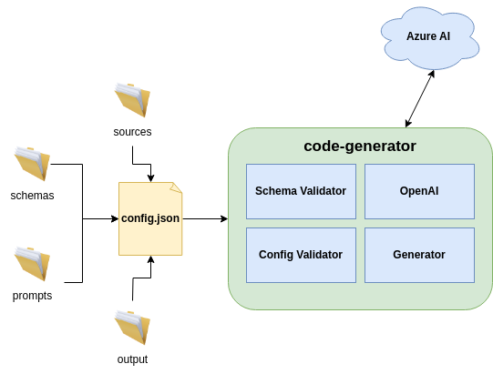
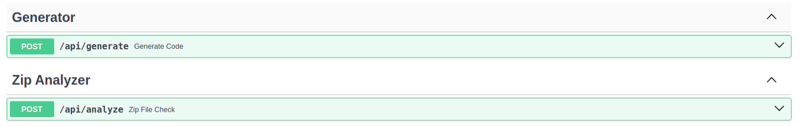

# Code Generator
Tool used to generate code base on schemas, sources and templates already defined/created,
using OpenAI.

# High Level Diagram


# Getting Started
## Environment Variables
The following environment variables are needed to run the code_generator tool:

| **Environment Variable**  | **Description**                                                 |
|---------------------------|-----------------------------------------------------------------|
| API_KEY                   | The OpenAI/Azure Api Key to be used                             |
| OPENAI_MODEL              | The specific OpenAI Model to be used (i.e. gpt-3.5-turbo-16k)   |
| OPENAI_INPUT_PRICE        | The current OpenAI Model input price                            |
| OPENAI_OUTPUT_PRICE       | The current OpenAI Model output price                           |
| OPENAI_RETRIES            | Number of retries in case of error.                             |
| OPENAI_RETRY_SLEEP_TIME   | Time to wait (in seconds) until the next retry                  |
| OPENAI_API_TYPE           | Azure related API type                                          |
| AZURE_API_BASE            | Azure related API base URL                                      |
| AZURE_API_VERSION         | Azure related API version to be used                            |
| AZURE_DEPLOYMENT_ID       | Azure related deployment ID                                     |
| OPENAI_INSTRUCT_MODEL_USE | Boolean variable to specify if the instruct model is being used |

_Note:_ The maximum context length for `gpt-35-turbo-instruct` model is *16385 tokens*

## Preparing the environment
The following steps are needed to properly use the tool:
1. Create a venv: `python3.10 -m venv venv`
2. Activate the venv: `source venv/bin/activate`
3. Install all needed dependencies: 
  `(venv) pip install -r requirements/dev.txt -r requirements/prod.txt -r requirements/test.txt`

Once the above steps are done, the environment will be ready to execute the tool successfully.

## Installing the tool
By running `pip install .` into the *code_generator* folder, the tool will be installed
as a Python library to be easily used.

## How To Use
```
Usage: code_generator [OPTIONS] COMMAND [ARGS]...

  CLI to interact with the Code-Generator.

Options:
  --version  Show the version and exit.
  --help     Show this message and exit.

Commands:
  check-credentials  Checks if OpenAI credentials were configured correctly...
  generate-code      Generates code based on the input source architecture...
  run-service        Run the code generator as a service to be consumable...
  show-credentials   Shows the credentials to be used with OpenAI.
```
The following information represents the `generate-code` argument help:
```
Usage: code_generator generate-code [OPTIONS]

  Generates code based on the input source architecture using IA.

Options:
  -c, --config PATH  A config file.  [required]
  -l, --log FILE     Logging will be saved to this file if given.
  -d, --debug        Sets the DEBUG log-level.
  -s, --stats        Gets stats for the generated code.
  -v, --verbose      Sets the verbosity level.
  --help             Show this message and exit.
```

## Using the tool as a service

In order to expose the use of the tool via API, the following command line needs to be executed:
```
$> code_generator run-service
```

Expected output:
```
INFO:     Started server process [13468]
INFO:     Waiting for application startup.
INFO:     Application startup complete.
INFO:     Uvicorn running on http://0.0.0.0:8000 (Press CTRL+C to quit)
```

### Run the service as a Docker container

The tool can also run within a Docker container. Regularly, Docker images are pushed to:

<https://hub.docker.com/r/agucarranza/code-generator>

and can be deployed using the `docker-compose.yml` file from the repository.
In order to do that:

- Replace the `API_KEY` placeholder in `docker-compose.yml` file with an actual value.
- Run `docker-compose up` at the `code_generator` directory:

```bash
[Generation%20Code%20Tool]$ cd code_generator
[Generation%20Code%20Tool/code_generator]$ docker-compose up
Starting code_generator_code-generator_1 ... done
Attaching to code_generator_code-generator_1
code-generator_1  | INFO:     Started server process [1]
code-generator_1  | INFO:     Waiting for application startup.
code-generator_1  | INFO:     Application startup complete.
code-generator_1  | INFO:     Uvicorn running on http://0.0.0.0:8000 (Press CTRL+C to quit)
```

# Available APIS

| **Method** | **URL Pattern**              | **Description**                                           |
|------------|------------------------------|-----------------------------------------------------------|
| POST       | /api/generate                | Method to generate code based on a zip file input         |
| POST       | /api/check                   | Method to check if the zip file input is correctly formed |




For further information visit http://127.0.0.1:8000/docs when the server is up.


## Using a config file with command line

In order to use the tool with an already defined config.json file, the following
command line arguments need to be executed:

- Using the tool as a Python installed library:
```
$> code_generator generate-code -c <config_file_path>
```
- Using the tool using python command:
```
$> python -m code_generator generate-code -c <config_file_path>
```
The `config.json` file should look like the following:
```
{
  "comment": "This is well formed config file.",
  "paths": {
    "root": "<path_to_the_root>",
    "sources": "<path_to_the_sources>",
    "prompts": "<path_to_the_prompts>",
    "schemas": "<path_to_the_schemas>",
    "output":  "<path_to_the_output>"
  },
  "targets": [
    {
      "generate": true/false,
      "output": "{output}/address.html",
      "prompt": {
        "file": "{prompts}/address.prompt",
        "tags": [
          { "tag": "{{source_code}}", "file": "{sources}/person.html"},
          { "tag": "{{source_schema}}", "file": "{schemas}/person_schema.json"},
          { "tag": "{{target_schema}}",   "file": "{schemas}/address_schema.json"},
          { "tag": "{{type}}", "value": "html"}
        ]
      }
    }
  ]
}
```

## Developer Guide

The following is documentation for developers that would like to contribute to this project:

### Testing

This project uses pytest to manage and run unit tests (located in the `tests`directory).
You can run them manually with:
```
./tools/run_tests.sh
```
Define extra pytest arguments:
```
export PYTEST_EXTRA_ARGS=-vv
./tools/run_tests.sh 'not (end_to_end)'
```
To run the entire application (automatically), you can run the next command:
```
./tools/run_tests.sh '(end_to_end)'
```


#### Run tests with coverage

Run the tests and check the code coverage to see where more testing is needed:
```
./tools/run_coverage_tests.sh
```

### Local Linting

There are a few linters/code checks included with this project to speed up the
development process:

* Black - An automatic code formatter, never think about python style again.
* Isort - Automatically organizes imports in your modules.
* Pylint - Check your code against many of the python style guide rules.
* Mypy - Check your code to make sure it is properly typed.

You can run these tools automatically in check mode, meaning you will get an error
if any of them would not pass with:

```
./tools/run_checks.sh
```

Or actually automatically apply the fixes with:

```
./tools/apply_linters.sh
```

There are also scripts in `./tools/` that includes run/check for each individual
tool.

## Installers
An installer for Linux, Windows and MacOS can be created.

Using `pyinstaller` we can create a zip file with all the content needed to run this tool.

To generate the installer (with python env activated), on a target machine run the next commands:

```commandline
$ python tools/create_installer --target=[TARGET]
```
Where:

`--target` can be `linux`, `windows` or `macos`.

A zip file with the name `code_generator_{target}_{version}.zip` will be generated.

To run the tool, just unzip this file and execute the `code_generator_tool` binary.

All the dependencies needed will be included in the zip file.

The env variables (or the `.env` file) must be configured.

## Build a dev docker image

- If building a new Docker image is required, run the following and replace the tag accordingly:

```bash
[Generation%20Code%20Tool]$ cd code_generator
[Generation%20Code%20Tool/code_generator]$ docker build . -t john-doe/code-generator:1.0.1-dev
```

- Replace the reference of the image in `docker-compose.yml` file:

```yaml
[...]
services:
  code-generator:
    image: john-doe/code-generator:1.0.1-dev
[...]
```

- Run `docker-compose down` and `docker-compose up` again in order to recreate the container.
