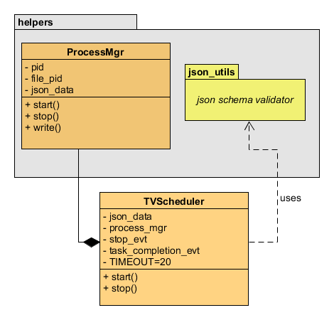

# Scheduler
The TVScheduler program is in charge of executing a task in a specific time every day. Once this program is executed a 
Keyboard Interrupt will be needed to stop it. 

## Architecture

## Design choices
I focused my solution on simplicity and responsibilities. Following I'll list some key points I based on to achieve the 
expected outcome:
- Taking into account that the input JSON data should follow a specific pattern I decided to use the `jsonshema` library
to validate the correct JSON format. That way, if there is missing field, or `time` key has more than five characters
the application will fail.
- I've created a Process Manager class to hold all processes related matter. By doing this, TVScheduler only will call 
specific methods based on the action to be done.
- I considered a timeout of 20 seconds a good task wait time.
- I used already implemented libraries for the specific matters like getting running processes information (psutil),
validating input JSON formats (jsonschema) and running functions periodically (schedule).

## Platform used
This program has been developed and tested in an `Ubuntu 20.04` Operating System using `Python 3.8.10`

## Prerequisites
The following Python libraries will be needed in order to run the application:

|Library|Purpose|
|---|---|
|`jsonchema`|Allows to validate input json files against defined schemas| 
|`psutil`|Allows to retrieve information about running processes|
|`schedule`|Allows to run python functions periodically|

In order to get all these libraries installed the following command should be executed:
`pip3 install -r requirements.txt`

## Application usage
The following command should be executed in order tu run the application:

`python3 TVScheduler.py config_files/<start|write|stop>.json`